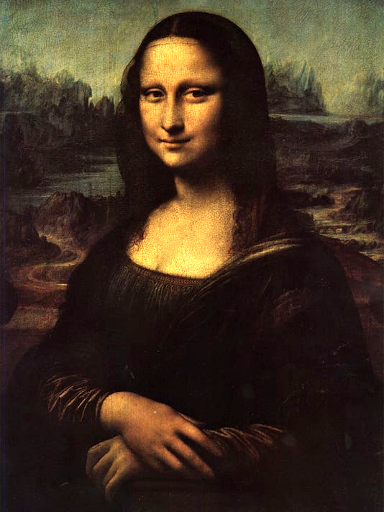
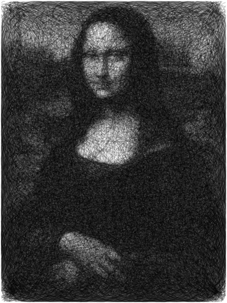
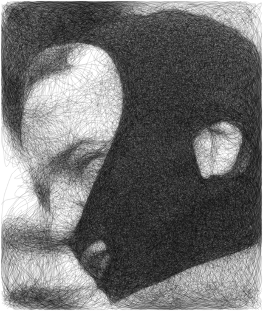
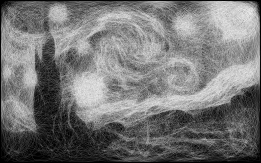
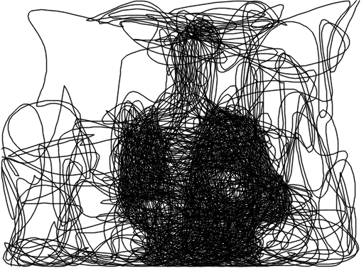

# Linefier
A program used to replicate images using a single smooth line.

## Installation
After cloning the repository you will need to install both opencv and numpy. You can install them with `pip3 install -r requirements.txt`  

## Usage
`python3 linefier.py path/to/image [arguments]`  
Use `python3 linefier.py --help` for information about available arguments

## Examples
 |Command|Original image|Generated image|
 |-|-|-|
 |`python3 linefier.py` `mona.png`|||
 |`python3 linefier.py` `mask.png` `--tries 500` `--opacity 0.25`||
 |`python3 linefier.py` `starry.png`  `--tries 500`  `--opacity 0.1`  `--line_color 1`  `--background_color 0`|||
 |`python3 linefier.py` `rick.png` `--tries 1000` `--opacity 0.5` `--curves 2000`|||
